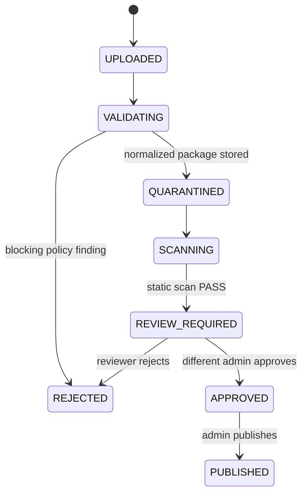

# Veyra Upgrade Guide

> **Status:** implemented as a release candidate in the Veyra Browser and Veyra Server repositories. The secured extension pipeline and Veyra Assistant are disabled or fail closed when their required server configuration is absent.

## 1. Platform overview

Veyra is a browser client backed by a Node/Express service for proxy browsing, search, account data, Veyra AI search answers, and platform operations. This upgrade adds two deliberately bounded subsystems:

1. **Veyra Extension Store Security** — legacy CSS-only `v1` packages plus signed, human-reviewed executable `v2` packages, server-side static checks, quarantine, auditable publication, and explicit per-device permission consent.
2. **Veyra Assistant** — a consent-aware, multi-agent assistance service. Two analysts work independently in parallel; a verifier receives their structured findings and produces the user-facing answer.

Neither subsystem grants an extension arbitrary code execution or gives Assistant automatic access to the user’s browser, tabs, cookies, account data, or page contents.

## 2. End-user guide

### Install an extension safely

1. Open **Extensions → Store**.
2. Review the publisher, site matches, `PASS` scan state, signing state, and shortened SHA-256 integrity value.
3. Select **Review & install**.
4. Confirm the exact requested permissions and site scope. For JavaScript packages, read the residual-risk warning before approving.

Store listings intentionally do **not** display invented ratings or download totals. CSS-only `v1` packages can only modify page styling. Signed `v2` packages may include content scripts and an opaque-origin background iframe. Content scripts run in the matching page context and can read or alter page content; background scripts have a stricter CSP sandbox and only receive the extension-local storage API. Executable Store packages require a trusted Ed25519 signature, completed static checks, a distinct administrator review, HTTPS host matches, and explicit install consent on each device.

### Use Veyra Assistant

1. Sign in and open **Veyra Assistant** from the browser menu or ` /assistant ` route.
2. Enter a question. This is submitted to the configured model provider only after selecting **Ask Veyra Assistant**.
3. Optionally paste a page URL, title, or selected text. The UI requires an explicit consent switch before any pasted context is sent.
4. Read the verified answer, caveats, and next steps. The UI shows workflow completion states, not private chain-of-thought or agent prompts.
5. Optional feedback is not retained for training unless the separate training-consent switch is enabled.

The Assistant does not automatically browse, inspect tabs, read cookies, capture selection, or execute browser actions.

### Developer mode warning

Developer mode is for local experimentation, not the public Store. It can import local userscripts or content-script bundles only after an explicit warning. Such scripts are never synced to the account, never published through the Store, and are blocked when they contain network, cookie, worker, or dynamic-code patterns. Treat all developer-mode scripts as untrusted local code and use a test profile.

## 3. Developer guide

### Package formats

The public Store accepts legacy `veyra-extension/v1` CSS packages and the `veyra-extension/v2` executable bundle format. Archives and binary files remain unsupported; packages are JSON with allowlisted virtual file names only.

```json
{
  "schema": "veyra-extension/v1",
  "id": "quiet-reading",
  "name": "Quiet Reading",
  "version": "1.0.0",
  "description": "Reduces visual noise on a documented site.",
  "permissions": ["styles"],
  "matches": ["https://docs.example.com/*"],
  "files": {
    "style.css": "main { max-width: 72ch; }"
  },
  "category": "reading",
  "tags": ["focus", "typography"]
}
```

Executable v2 example:

```json
{
  "schema": "veyra-extension/v2",
  "id": "reading-helper",
  "name": "Reading Helper",
  "version": "1.0.0",
  "description": "Adds a small reading aid on the documentation site.",
  "author": "Example publisher",
  "publisher": "Example publisher",
  "permissions": ["content_scripts", "background", "storage"],
  "matches": ["https://docs.example.com/*"],
  "files": {
    "content/reading.js": "document.documentElement.dataset.readingHelper = 'on';",
    "background.js": "Veyra.storage.set('installed', true);"
  },
  "privacyPolicy": "https://example.com/privacy",
  "dataDisclosure": "Stores a local installed flag.",
  "networkDisclosure": "No network access in the background sandbox."
}
```

Sign the normalized package locally with the publisher's Ed25519 private key using exported `signExtensionPackage` from `src/services/extension-security.js`. Keep the private key out of the Veyra server, repository, CI logs, and client. Configure only the matching public PEM key in `VEYRA_EXTENSION_TRUSTED_KEYS_JSON`; every package containing JavaScript requires a trusted signature, even when `VEYRA_EXTENSION_REQUIRE_SIGNATURE=false`.

### Rules enforced by the server

| Area | Constraint |
|---|---|
| Transport | JSON only; archive and binary upload endpoints return `415 EXTENSION_ARCHIVE_UNSUPPORTED` |
| Files | v1: `style.css`; v2: optional `style.css`, `background.js`, and `content/*.js`; no arbitrary paths |
| CSS | Maximum 120 KB; blocks `@import`, `url()`, `javascript:`, CSS expressions, bindings, behaviors, remote fonts, and namespaces |
| Runtime | v2 supports CSS, content scripts, an opaque-origin background iframe, and extension-local storage |
| Declared permissions | `styles`, `content_scripts`, `background`, `storage`, `cookies`, `network`, `tabs`; `tabs` is disclosure-only and has no callable API yet |
| Scope | Up to 30 validated web match patterns; executable packages require explicit HTTPS hosts and may not use wildcard hosts or all-site access |
| Manifest | Worker/service-worker imports, native messaging, WebAssembly, binaries, archives, remote assets, and unknown fields are rejected |
| Limits | CSS 120 KB; each JS file 64 KB; total JavaScript 80 KB |
| Integrity | Canonical manifest and every virtual file are included in the SHA-256 integrity record and publisher signature |
| Publisher signing | Executable packages must verify against a configured trusted Ed25519 key; all releases also require separate human approval |

Static scanner findings are heuristic; they are **not malware detection** and cannot prove code harmless. Signatures prove package provenance/integrity, not benign intent. Content scripts run in the visited page's JavaScript context and can access page DOM; the install prompt states this risk. `cookies` and `network` are package disclosures plus detectable-pattern checks, not an unbypassable API membrane for page-context scripts. Background code runs in an iframe with an opaque origin, network/resource CSP restrictions, and only the `Veyra.storage` bridge, but it shares the browser renderer thread and can still consume CPU or freeze the Veyra tab. Do not add archive extraction, remote code loading, or additional privileged APIs without a new threat-model review.

### Submission and review lifecycle



A publisher cannot approve their own submission. Publication requires `APPROVED` state and a `PASS` scan. Immutable-ish event records are persisted server-side; there is no deletion API for publishers.

## 4. API reference

All write endpoints use bearer authentication. Reviewer and audit endpoints require an administrator.

| Method | Endpoint | Auth | Purpose |
|---|---|---:|---|
| `GET` | `/api/extensions/policy` | No | Read the active package policy and limits |
| `GET` | `/api/extensions/store` | No | List published v1/v2 packages with security metadata |
| `GET` | `/api/extensions/store/:id` | No | Read a published package |
| `POST` | `/api/extensions/verify` | No | Validate and statically scan a package without storing it |
| `POST` | `/api/extensions/upload` | User | Always rejects archive/binary transport (`415`) |
| `POST` | `/api/extensions/submissions` | User | Submit a JSON package into quarantine |
| `GET` | `/api/extensions/submissions/mine` | User | View the caller’s submissions and state history |
| `GET` | `/api/extensions/reviews` | Admin | Review queue and per-submission audit trail |
| `POST` | `/api/extensions/reviews/:id/decision` | Admin | Approve or reject; reviewer must differ from publisher |
| `POST` | `/api/extensions/reviews/:id/publish` | Admin | Publish an approved, passing package |
| `GET` | `/api/extensions/audit` | Admin | Read audit events |
| `GET` | `/api/assistant/status` | No | Check whether Assistant is configured; exposes no secret |
| `POST` | `/api/assistant/ask` | User | Run the consent-aware two-analyst-plus-verifier workflow |
| `POST` | `/api/assistant/feedback` | User | Submit optional feedback; content is retained only with explicit training consent |

### Assistant request contract

```json
{
  "question": "Help me turn this requirement into a release plan.",
  "context": {
    "url": "https://example.com/spec",
    "title": "Example specification",
    "selectedText": "Only text the user explicitly chose to share."
  },
  "consent": { "sendPageContext": true }
}
```

If any page context is present without `sendPageContext: true`, the service returns `400 ASSISTANT_CONTEXT_CONSENT_REQUIRED`. The server rate-limits each user and fails closed when no model provider is configured.

The response contains a verified answer, caveats, suggested next steps, evidence status, and non-sensitive workflow status. It does not return hidden reasoning, system prompts, or full intermediate agent messages.

## 5. Deployment and operations

### Required baseline

- TLS must terminate before the API is exposed publicly.
- Set a long random `VEYRA_AUTH_SECRET` and at least one `ADMIN_EMAILS` value.
- Set `VEYRA_ADMIN_TOKEN` before enabling remote configuration administration.
- Use a private, backed-up data directory for `VEYRA_DATA_DIR`; its extension and assistant subdirectories are created with restricted permissions.
- Run current dependency and source checks in CI before deployment.

### Extension Store configuration

| Variable | Default | Meaning |
|---|---|---|
| `VEYRA_EXTENSION_DATA_DIR` | `${VEYRA_DATA_DIR}/extensions` | Quarantine, release, and audit data location |
| `VEYRA_EXTENSION_REQUIRE_SIGNATURE` | `false` | Require signatures for all submissions; executable v2 packages always require trusted signatures |
| `VEYRA_EXTENSION_TRUSTED_KEYS_JSON` | `{}` | JSON object mapping trusted `keyId` values to PEM public keys |

Configure and test trusted publisher public keys in staging. Executable packages are rejected when no matching trusted key exists. Built-in catalog items are maintained source artifacts and are statically validated on read.

### Veyra Assistant configuration

| Variable | Default | Meaning |
|---|---|---|
| `OPENAI_API_KEY` | unset | Model-provider credential; never expose to the client |
| `OPENAI_API_BASE` | unset | OpenAI-compatible provider base URL |
| `VEYRA_ASSISTANT_MODEL` | unset | Model identifier; Assistant remains disabled until set |
| `VEYRA_ASSISTANT_TIMEOUT_MS` | `20000` | Per-provider-call timeout (1–60 seconds) |
| `VEYRA_ASSISTANT_REQUESTS_PER_WINDOW` | `8` | Per-user request budget |
| `VEYRA_ASSISTANT_RATE_WINDOW_MS` | `600000` | Rate-limit window |
| `VEYRA_ASSISTANT_DATA_DIR` | `${VEYRA_DATA_DIR}/assistant` | Feedback review queue location |
| `VEYRA_ASSISTANT_FEEDBACK_RETENTION_MS` | 30 days | Opt-in feedback retention, bounded to 1–365 days |

Configure an OpenAI-compatible model that supports JSON-schema structured output. Veyra Assistant submits three bounded model calls per successful request: two independent analysts in parallel and one verifier. Tune per-user limits and provider spend controls before enabling it in production.

### Rollout checklist

1. Deploy to staging with trusted signing keys configured; test a CSS package and a signed executable package through all lifecycle states.
2. Verify archives, unsigned code, wildcard executable scopes, and blocked remote CSS are rejected.
3. Confirm reviewers inspect every JS file and scanner warning, and that the publisher cannot review their own submission.
4. Configure a non-production Assistant provider and verify the consent rejection path, rate limit, timeout, and unavailable-provider path.
5. Enable monitoring for `STORE` and `ASSISTANT` log components.
6. Back up the protected data directory and rehearse restore procedures.
7. Promote as a **reviewed executable Store with explicit per-device install consent** and **opt-in Assistant**.

## 6. Security design

### Extension Store threat model

| Threat | Control |
|---|---|
| Malicious executable extension | Signature/provenance gate, explicit HTTPS scope, JSON virtual-file allowlist, static heuristic findings, independent human review, explicit per-device install consent; background code uses a restrictive opaque-origin iframe |
| Remote style exfiltration | Blocks imports, `url()`, script URIs, expressions, bindings, behaviors, namespaces, and remote font declarations |
| Path traversal / decompression attacks | No filesystem package paths and no archive parser |
| Store publication abuse | Quarantine, static scan, reviewer separation, approval requirement, publication state gate, audit events |
| Supply-chain tampering | Server-issued SHA-256 canonical integrity metadata; trusted Ed25519 signature is mandatory for executable packages |
| Client-side bypass | Browser asks server to re-verify before store install and installs the server-returned normalized package |
| Script propagation | Developer scripts and executable Store bundles are excluded from account sync; each device requires review/consent installation |

Content scripts still execute in the visited page's JavaScript context. Review their complete source and permissions; signatures and heuristic checks cannot guarantee safety. Do not use high-value sessions with extensions you do not trust.

### Assistant privacy model

- User question is submitted only when the user presses the request button.
- Page-derived context is not collected automatically. Context must be pasted and explicitly approved.
- Analyst prompts instruct models to treat user context as untrusted reference data, not executable instructions.
- No browser automation, browser-session access, credentials, cookies, or account data is made available to agents.
- Rate limits and request-size limits reduce abuse and unexpected provider spend.
- Opt-in feedback is stored for time-limited **human review** only. It does **not** automatically train, fine-tune, or modify a model.

## 7. Versioning and release notes

Maintain semantic versioning for each repository. This upgrade should be recorded as a **minor** feature release because it adds APIs and user-visible capabilities while preserving existing browser routes.

### Unreleased — secure Store and Veyra Assistant

**Added**
- Quarantined CSS and signed executable v2 package lifecycle with audit history and per-device consent.
- HTTPS-scoped content scripts plus a restrictive background iframe with extension-local storage.
- SHA-256 integrity metadata, static security scan metadata, and optional Ed25519 trusted-publisher verification.
- Consent-aware Veyra Assistant with parallel independent analysts and verifier.
- Explicit opt-in feedback queue with retention and human-review-only policy.

**Changed**
- Store UI removes unauditable popularity claims and requires permission review before installation.
- Account sync excludes developer scripts and unverified/local extension content.
- Neural crawler mutations and challenge solving require authenticated users; destructive neural resets require administrators.

**Security**
- Browser and server both enforce CSS isolation.
- Local developer script execution is gated, scope-limited, and denied from account synchronization.

## 8. Support and incident response

For suspected malicious extension submissions, immediately stop Store publication, retain extension audit records, rotate any potentially affected provider/admin secrets, inspect reviewer actions, and notify impacted users through the normal incident process. Do not delete audit evidence before incident review.
